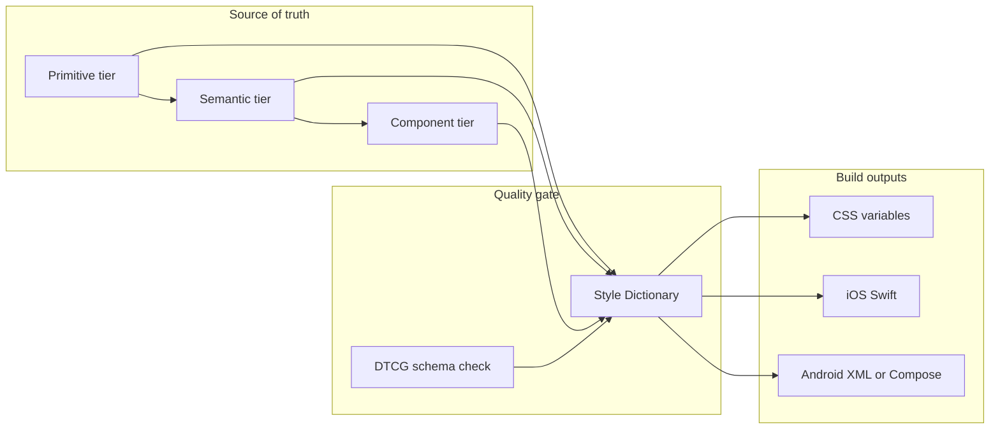

# Open source design token system (Quieto Tokens)

## Context

Your [Design Tokens.md](docs/Quieto%20Design%20System/Design%20Tokens.md) already states the mental model: platform-agnostic key–value decisions, a **three-tier** ladder (primitive → semantic → component), and vocabulary alignment (variables, theme variables, globals/aliases). You chose **multi-platform builds** and will **bring the naming algorithm into this repo** from Obsidian so it is not trapped in wikilinks like `[[Primitive Tokens]]`.

## Recommended architecture

- **Source format:** [DTCG](https://design-tokens.github.io/community-group/format/) JSON (or split JSON files merged at build time). Use `$type` / `$value` and **references** between tiers (semantic points at primitives; component points at semantic), which matches your tier story.
- **Build engine:** [Style Dictionary](https://amzn.github.io/style-dictionary/) (v4 if you want first-class DTCG paths and modern defaults). It is the most common OSS path for **one repo → many platforms**.
- **Package surface:** Publish either **pre-built artifacts** (`dist/`) or **source + build script**; many OSS token repos do both: `tokens/` for humans and machines, `build/` for generated files committed or produced in CI.

## Repository layout (concrete)

| Area | Purpose |
|------|---------|
| `tokens/primitive/`, `tokens/semantic/`, `tokens/component/` | Tiered token files (JSON), smallest files per category to reduce merge pain |
| `docs/naming-convention.md` (name flexible) | **Authoritative** naming algorithm and examples, migrated from Obsidian |
| `style-dictionary.config.mjs` (or `.js`) | Platforms, transforms, file headers |
| `scripts/` | Optional: validate references, fail on orphan tokens, generate tier index |
| `.github/workflows/` | On PR: install deps, schema validate, run SD, fail if outputs drift (if you commit builds) |

Keep [README.md](README.md) minimal: what the tiers mean, how to build, how naming maps to paths, and license (you already cite [LICENSE](LICENSE)).

## Naming algorithm in practice

1. **Document first:** Consolidate Obsidian pages into one markdown spec in-repo (sections: primitives, semantics, components, allowed scales, forbidden patterns, examples). This becomes the contract reviewers use.
2. **Encode second:** Reflect the spec in **file naming and token paths** (e.g. `color.text.primary` under semantic). Style Dictionary does not need a custom “algorithm runtime” unless you want codegen; usually the **path string is the algorithm’s output**.
3. **Optional strictness:** Add a small validator (script or SD preprocessor) that enforces prefixes per tier or regex patterns from your doc—only if the naming doc is stable enough to justify maintenance.

## Multi-platform scope (phased)

- **Phase 1 (MVP):** CSS custom properties + one mobile platform you care about most (often **iOS Swift** or **Android resource XML**), plus a successful `npm run build` in CI.
- **Phase 2:** Second mobile target, then any extras (React Native, SVG icon sizing, etc.) as separate SD “platforms”.

## OSS hygiene (lightweight)

- **Versioning:** Semver on the npm package; document breaking changes when **renaming or retyping** tokens.
- **Changelog:** `CHANGELOG.md` or GitHub Releases when you tag versions.
- **Contributing:** Short `CONTRIBUTING.md` only when you expect external PRs (how to run build, naming doc is law).

## Risks and mitigations

- **Wikilink-only specs:** Mitigated by your choice to commit the full naming rules; until then, SD file structure may churn—freeze the doc before heavy automation.
- **Figma drift:** Multi-platform from JSON does not replace Figma Variables unless you add a separate sync story later; call that explicitly out-of-scope for v1 unless you want Token Studio paths in phase 2.

## Success criteria

- A contributor can clone the repo, run one command, and get **consistent artifacts** for each declared platform.
- Token **references** resolve across tiers with no circular dependencies.
- The **naming document** in-repo matches the actual token paths in `tokens/`.
